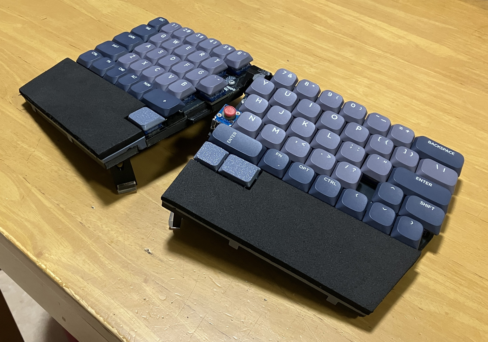
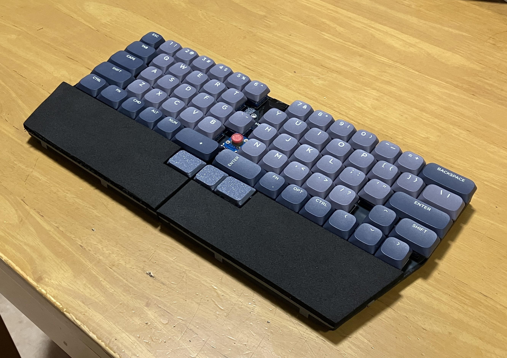
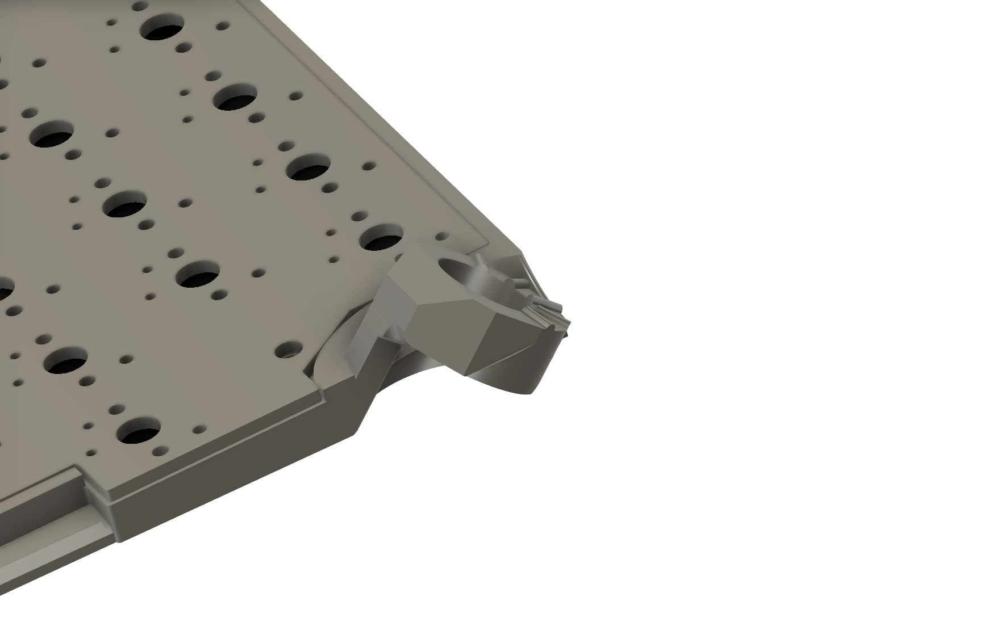
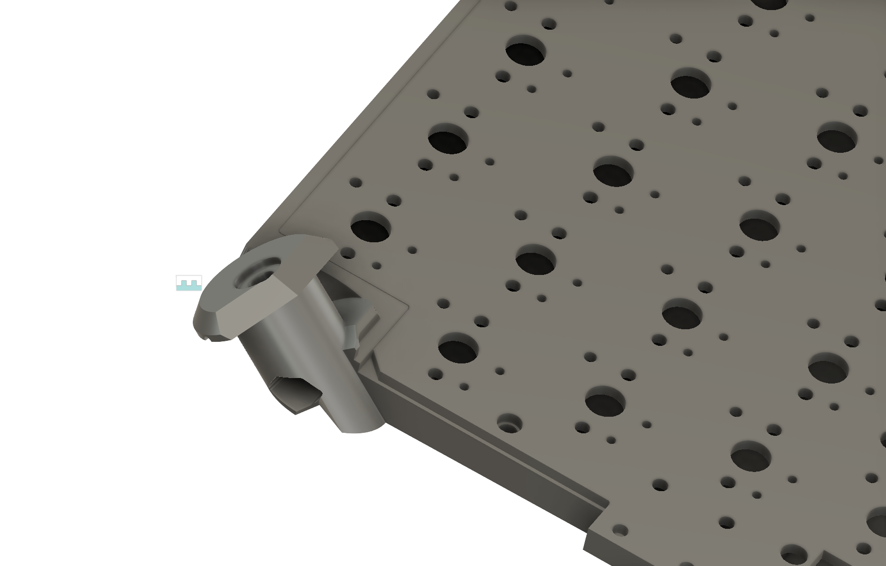
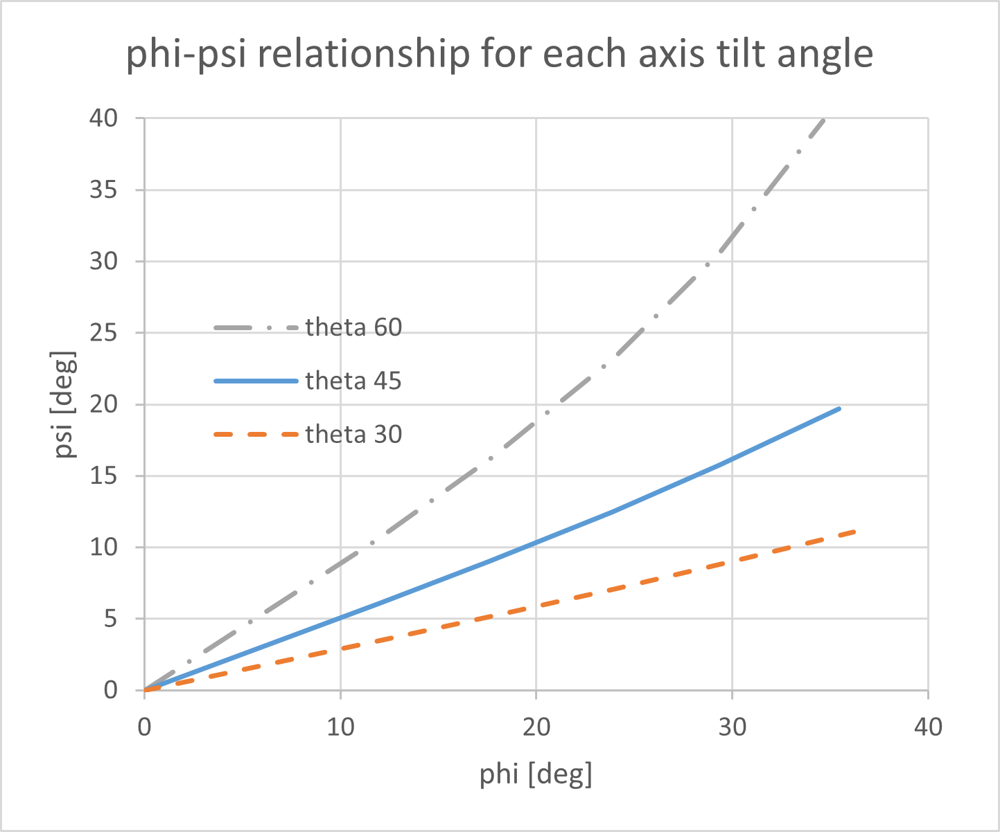
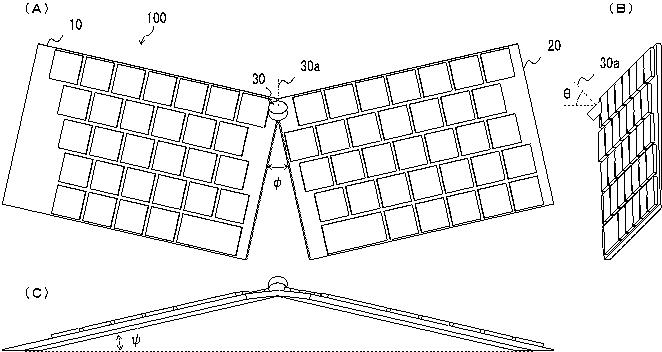

# Pineapple60-Convertible
[English](#english) | [Japanese](#japanese)

## English
Also known as the Pineapple60-C or p60c.

This keyboard features an ergonomic layout with a raised center and is convertible to a flat configuration.

The hinge geometry is patented in Japan for now.

### Concept
- Key layout equivalent to MS ergonomic keyboard (column staggered with a raised center)
- Becomes flat and compact when stored
- No Trackpoint, No Keyboard
- Difficult to use Trackpoint without palm rests

### Specification
- microcontroller: Atmega 32U4 mounted on the right PCB
- IO Expander: MCP23017 mounted on the left PCB
- TrackPoint Module: Sprintek SK8707-01-004
- Center connection: with 5 lines FFC
- Keyswitches: Mainly, Kailh Deep Sea Mini Pink Island Switch (choc V2)

### Gallery

[demonstration](https://youtu.be/z1uILMKhQXU)

[4kg load test](https://youtu.be/4jUbyRcCng4)
## Japanese
別名 Pineapple60-C または p60c。

中央の盛り上がったエルゴノミックレイアウトと平らな状態に変形可能なキーボード。

中央のヒンジ形状を今のところ日本で特許取得しました。

### Concept
- MS ergonomic keyboard と同等のキーレイアウト（中央が持ち上がったロースタッガード）
- 収納時は平らでコンパクトになる
- No Trackpoint No Keyboard
- パームレストがないとトラックポイントが使いずらい

### Hinge
中央のヒンジは傾斜角をもっている。以下に、試作1号機のヒンジ構造を表す。傾斜角45°

左右の開き角 $\phi$ と持上り角 $\psi$ は、下記式によりヒンジ傾斜角 $\theta$ とヒンジ回転角 $\phi_0$ によって決まる。(角度の意味は下にある図面参照)

$$
\sin\left(\frac{\phi}{2}\right) = \cos\theta \cdot \sin\left(\frac{\phi_0}{2}\right)
$$

$$
\sin\psi = \sin\theta \cdot \tan\left(\frac{\phi_0}{2}\right)
$$

傾斜角 $\theta$ に応じた $\phi$ - $\psi$ の関係は以下のグラフのようになる。傾斜角 $\theta=45^\circ$ にすると、開き角 $\phi=24^\circ$ の時に持上り角 $\psi=12.5^\circ$ 程度になる。ヒンジ傾斜角を増やせば、持上り角が増える。

中央の傾いたヒンジは今のところ日本で特許を取得しました。
個人による非営利目的の利用は自由ですが、販売・営利目的の譲渡を目的とした利用については、別途ライセンス契約が必要です。
saoto.tsuchiya@gmail.com

[特許第7853671号](https://www.j-platpat.inpit.go.jp/c1801/PU/JP-7853671/15/ja)

出願日：2025年12月23日

発明者：土屋　査大

【発明の名称】キーボード装置

【課題】左右のキー配列が一定の開き角を持ち、かつ立体的なアーチ型形状を備えたエルゴノミックキーボードであって、収納時はコンパクトになりつつ、展開時は最適な形態に一意に決めることができるキーボードを実現する。

【解決手段】左右のキーボードユニットは互いに対向する端部において旋回自在に第１のヒンジで連結されており、第１のヒンジの回転軸は垂直に対して上部が前方に傾斜角を持っており、第１のヒンジを旋回させて左右のキーボードユニットに開き角をつけると、中央部が持ち上がり全体がアーチ形状になることを特徴とする。

【図２】

### Casing

### PCB

### Firmware

### Links
All Pineapple projects repository:
https://github.com/saoto28/pineapple60

Twitter: https://x.com/saoto28

